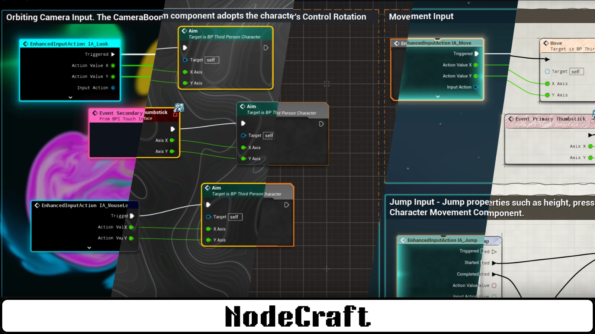
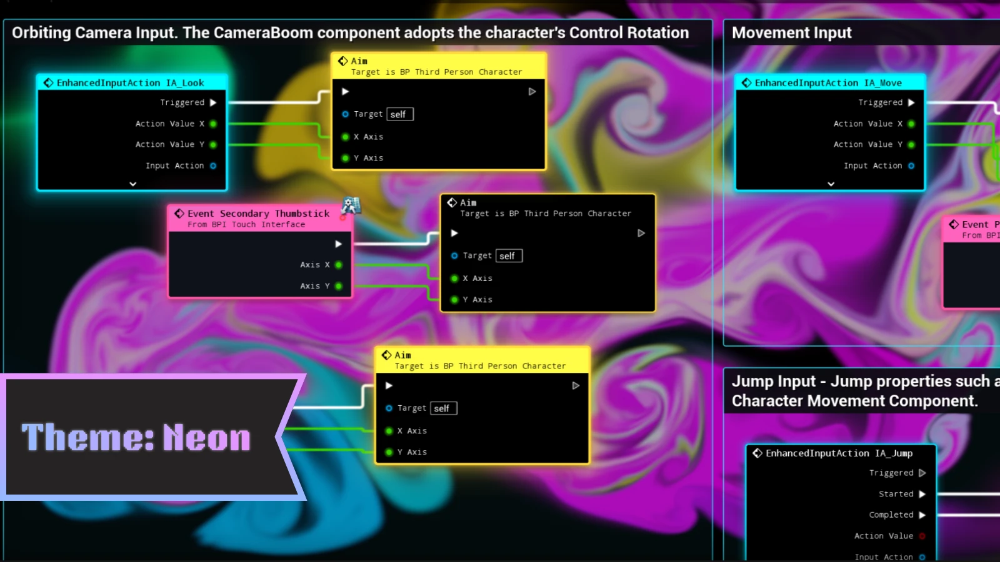
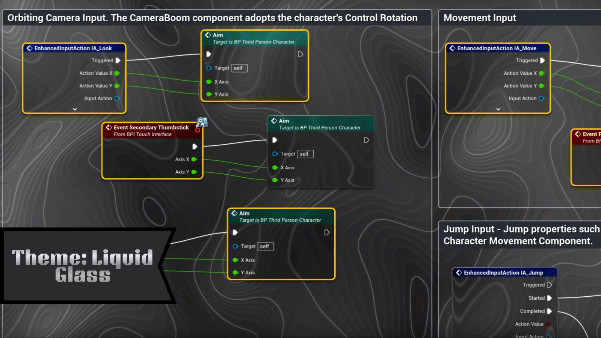
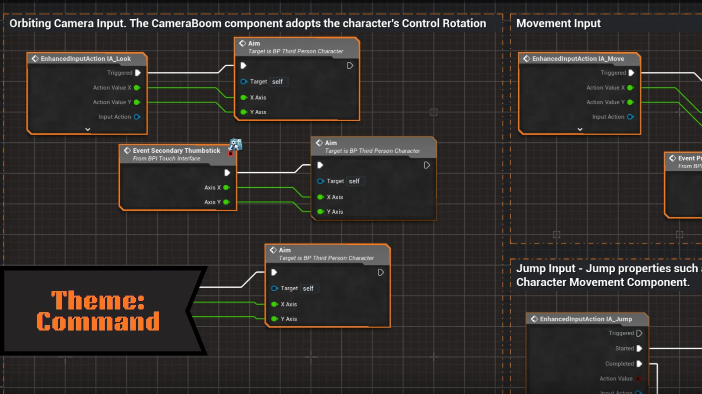
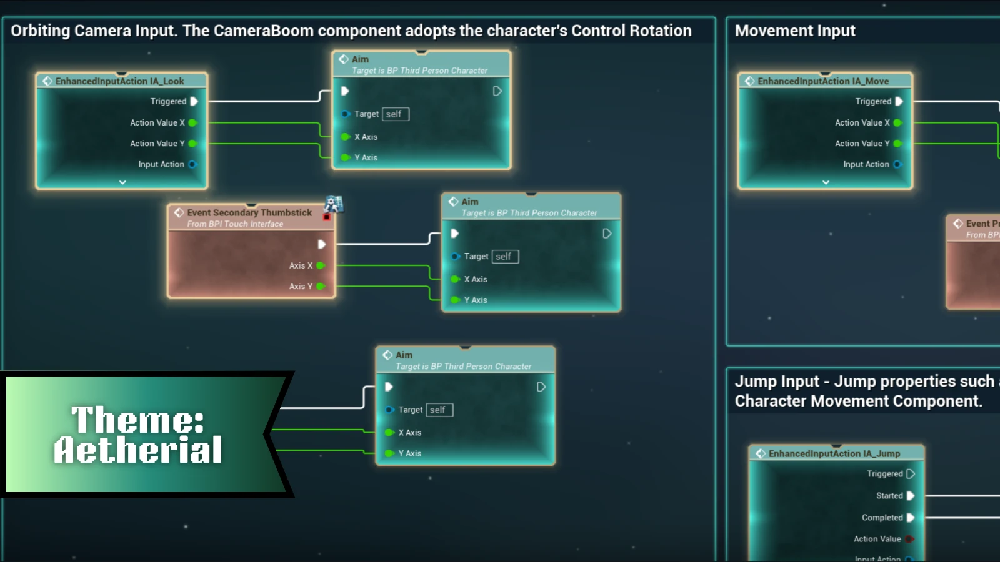
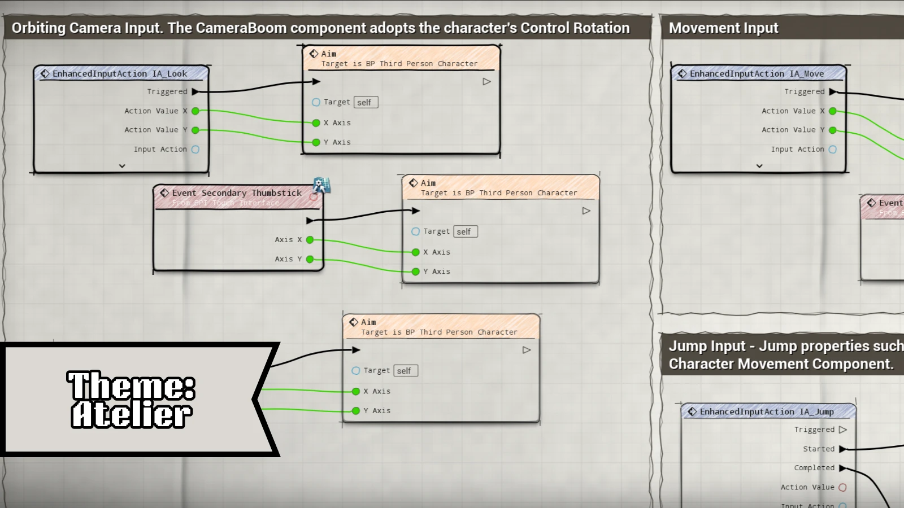

A NodeCraft theme restyles the whole graph as one set: node shapes and surfaces, pin icons, wires, comment boxes and the backdrop behind the graph.

Pick a theme from the **Themes** section of the [NodeCraft dropdown](/getting-started/quick-start/). Blueprint and Material graphs each have their own active theme.

## At a glance

| Theme | Feel | Routing | Backdrop |
|---|---|---|---|
| **Neon** | Dark and glowing | Subway | Live fluid simulation |
| **Liquid Glass** | Glassy and modern | Subway | Contour lines |
| **Command** | Precise and technical | Subway | Drafting grid |
| **Aetherial** | Calm and atmospheric | Manhattan (Blueprints), Subway (materials) | Animated starfield |
| **Atelier** | Hand-drawn | Sketch | Paper grain |
| **UE_Default** | Unreal's standard look | Default | Unreal's standard grid |

## Neon

Dark, saturated and glowing. The backdrop is a **live fluid simulation** that swirls when you open a graph and ripples as you move nodes through it. Node borders and wires glow in each node's colour, and selected nodes light up like buttons.

- **Routing:** Subway
- **Best for:** a bold, energetic look, and screenshots

## Liquid Glass

Glass nodes with rounded "bubble" shapes and coloured rims, over a contour-line backdrop. The light on each node follows your mouse cursor.

- **Routing:** Subway
- **Best for:** a clean, modern look

## Command

A precise, engineering-style look: graphite nodes framed in signal orange, on a technical drafting grid that stays readable as you zoom out. Comment boxes become dashed drafting lines with corner marks.

- **Routing:** Subway
- **Default theme:** Command is the theme new projects start on.
- **Best for:** large, busy graphs where readability comes first

## Aetherial

Deep space. Nodes glow softly in teal over an animated starfield backdrop.

- **Routing:** Manhattan in Blueprints, Subway in materials
- **Best for:** a calm, atmospheric look

## Atelier

Hand-drawn ink on paper. Every node border has its own organic pen wobble, and wires are sketched from pin to pin on a paper-grain backdrop.

- **Routing:** Sketch
- **Best for:** tutorials, presentations and documentation screenshots

## UE_Default

Turns NodeCraft's styling off and shows Unreal's standard graph look, while keeping the plugin installed. Useful for comparing, or when you want the stock look for a while.

## Comment boxes

Every theme also styles **comment boxes** and the small **comment bubbles** on nodes: Command uses a drafting chain line with corner ticks, Atelier a hand-drawn double stroke, Aetherial a soft glow, Liquid Glass a frosted edge, and Neon a cyan frame.

Themes only colour comments that still use the **default comment colour**. If you've given a comment its own colour, NodeCraft keeps it.

## Performance

Most themes cost next to nothing. **Neon** runs a real fluid simulation on the GPU, and **Aetherial**'s backdrop animates continuously. If the editor feels slow on a lower-end machine, switch to **Command**, **Liquid Glass** or **Atelier**.

## Want to change a theme?

Every colour, material, pin icon, font and shape comes from a theme asset you can edit. See [Customizing themes](/guides/customizing-themes/).
