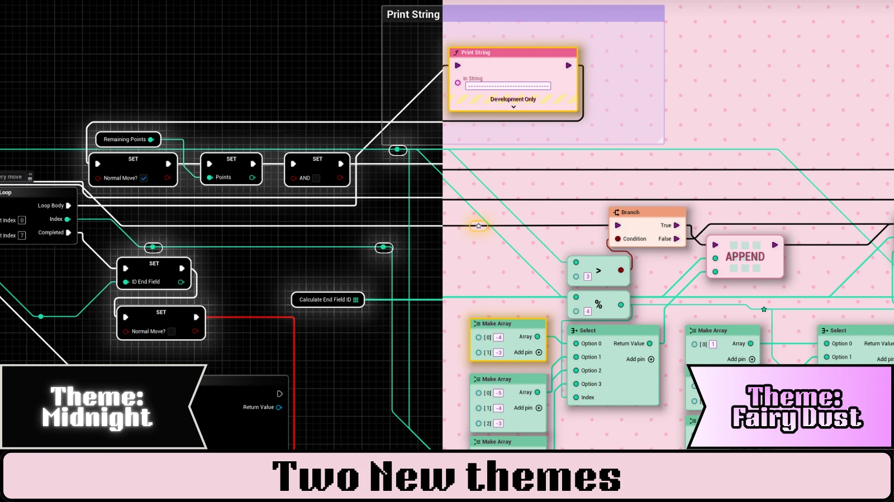
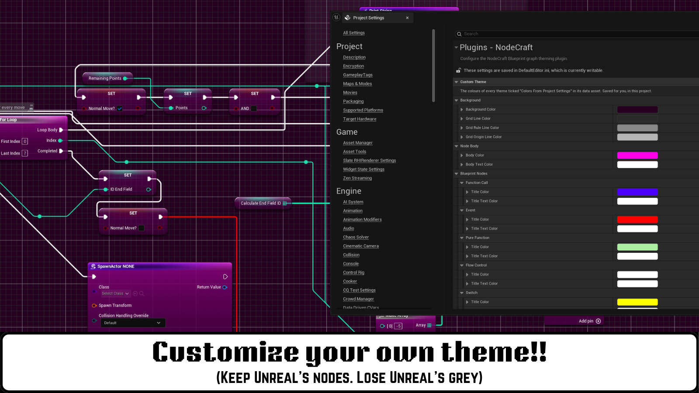

A NodeCraft theme restyles the whole graph as one set: node shapes and surfaces, pin icons, wires, comment boxes and the backdrop behind the graph.

Pick a theme from the **Themes** section of the [NodeCraft dropdown](/getting-started/quick-start/). Blueprint and Material graphs each have their own active theme.

## At a glance

| Theme | Feel | Routing | Backdrop |
|---|---|---|---|
| **Neon** | Dark and glowing | Subway | Live fluid simulation |
| **Liquid Glass** | Glassy and modern | Subway | Contour lines |
| **Command** | Precise and technical | Subway | Drafting grid |
| **Aetherial** | Calm and atmospheric | Manhattan (Blueprints), Subway (materials) | Animated starfield |
| **Atelier** | Hand-drawn | Sketch | Paper grain |
| **Midnight** | Flat black, Unreal's shapes | Subway | Quiet grain |
| **Fairy Dust** | Soft and playful | Subway | Polka dots |
| **Custom** | Unreal's nodes, your colours | Default | Unreal's grid, recoloured |
| **UE_Default** | Unreal's standard look | Default | Unreal's standard grid |

## Neon

Dark, saturated and glowing. The backdrop is a **live fluid simulation** that swirls when you open a graph and ripples as you move nodes through it. Node borders and wires glow in each node's colour, and selected nodes light up like buttons.

- **Routing:** Subway
- **Best for:** a bold, energetic look, and screenshots

## Liquid Glass

Glass nodes with rounded "bubble" shapes and coloured rims, over a contour-line backdrop. The light on each node follows your mouse cursor.

- **Routing:** Subway
- **Best for:** a clean, modern look

## Command

A precise, engineering-style look: graphite nodes framed in signal orange, on a technical drafting grid that stays readable as you zoom out. Comment boxes become dashed drafting lines with corner marks.

- **Routing:** Subway
- **Default theme:** Command is the theme new projects start on.
- **Best for:** large, busy graphs where readability comes first

## Aetherial

Deep space. Nodes glow softly in teal over an animated starfield backdrop.

- **Routing:** Manhattan in Blueprints, Subway in materials
- **Best for:** a calm, atmospheric look

## Atelier

Hand-drawn ink on paper. Every node border has its own organic pen wobble, and wires are sketched from pin to pin on a paper-grain backdrop.

- **Routing:** Sketch
- **Best for:** tutorials, presentations and documentation screenshots

## Midnight

Flat black, built on **Unreal's own node shapes** rather than a custom silhouette, so nothing about the layout feels unfamiliar. Bodies are black, titles are dark grey and fade along their length, and borders are thin and grey. Event nodes keep a red title so they still stand out. The backdrop is a quiet grain with no animation.

- **Routing:** Subway
- **Best for:** long sessions, and anyone who wants Unreal with the glare turned down

## Fairy Dust

Pastel nodes on a polka-dot backdrop, with pin icons drawn as bubbles, arrows, hearts and stars. The lightest theme in the set, and the only pale one.

- **Routing:** Subway
- **Best for:** a soft, friendly look, and a change from dark editors

## Custom

Keeps Unreal's own node art and changes only the colours. Nothing new to learn: the nodes, gloss and shadows are the ones Unreal draws, recoloured to your palette.

Set the colours in **Project Settings → Plugins → NodeCraft → Custom Theme**: a title and title text colour for each node type, the body and body text colour, and four grid colours. **Reset to Unreal** puts everything back.

Your colours are saved for you, per project, not inside the plugin — so an update never overwrites them, and nothing changes for anyone else on your team unless they set their own.

- **Routing:** Default (Unreal's splines)
- **Best for:** keeping Unreal's look while making your graphs yours

## UE_Default

Turns NodeCraft's styling off and shows Unreal's standard graph look, while keeping the plugin installed. Useful for comparing, or when you want the stock look for a while.

## Comment boxes

Every theme also styles **comment boxes** and the small **comment bubbles** on nodes: Command uses a drafting chain line with corner ticks, Atelier a hand-drawn double stroke, Aetherial a soft glow, Liquid Glass a frosted edge, and Neon a cyan frame.

Themes only colour comments that still use the **default comment colour**. If you've given a comment its own colour, NodeCraft keeps it.

## Performance

NodeCraft is editor-only: it never compiles into your packaged game. While you drag nodes around, the plugin costs roughly **1 ms of CPU per frame**, and wire routing is **under 0.2 ms** of that, on every theme.

What differs between themes is GPU work for the backdrop. Measured on a 40-node Blueprint at 1080p, **Neon**'s fluid simulation adds about 12.8 ms of render-thread time and **Fairy Dust**'s backdrop about 5.8 ms. **Midnight**, **Command**, **Atelier**, **Aetherial** and **Custom** add effectively none.

If the editor feels slow on a lower-end machine, switch to one of those.

## Want to change a theme?

Every colour, material, pin icon, font and shape comes from a theme asset you can edit. See [Customizing themes](/guides/customizing-themes/).
