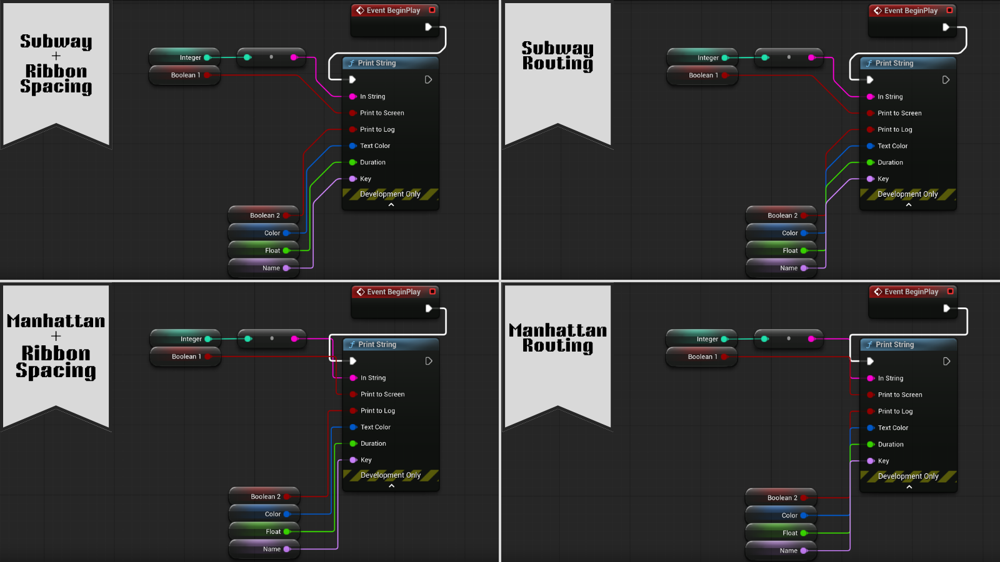

import RoutingDiagrams from '../../../components/RoutingDiagrams.astro';

NodeCraft draws wires in three main ways. Choose one from the **Routing** section of the [NodeCraft dropdown](/getting-started/quick-start/).

<RoutingDiagrams />

## The three styles

| Style | What it looks like | Routes around nodes |
|---|---|---|
| **Default** | Unreal's native curved splines | No (Unreal's own behaviour) |
| **Manhattan** | Straight lines with 90° turns | Yes |
| **Subway** | Straight lines with 45° and 90° turns, like a transit map | Yes |

Manhattan and Subway look for a clear path around the nodes in the way. If the only way around is a long detour, they go straight through instead, because a short wire crossing a node is easier to read than one that wanders across the graph.

Wires are designed to stay still while you pan and zoom. They only re-route when nodes actually move.

:::note[Sketch]
The Routing menu also has **Sketch**, a hand-drawn pen stroke made for the Atelier theme. It goes straight from pin to pin rather than around nodes.
:::

## Theme Default vs. pinning a style

Each theme comes with the routing style it was designed around:

| Theme | Routing |
|---|---|
| Neon | Subway |
| Liquid Glass | Subway |
| Command | Subway |
| Aetherial | Manhattan in Blueprints, Subway in materials |
| Atelier | Sketch |
| UE_Default | Default |

With **Theme Default** selected, routing follows the theme and changes when you switch theme.

Selecting a specific style **pins** it. The pinned style stays through theme switches and editor restarts, because the way you like your wires is usually a personal preference rather than part of a look. To go back to following the theme, select **Theme Default**.

Blueprint and Material graphs each have their own routing setting.

## Wire spacing

When several wires would run along the same path, **Wire Spacing** spreads them into parallel lanes so each wire stays visible:

- **Off**: every wire follows its exact route, so shared paths overlap.
- **1**: 6-pixel lanes. This is the default.
- **2**: 12-pixel lanes.

Only the turns move. Straight runs stay straight, and a node with a single output keeps its wire exactly where it was. Spacing applies to Manhattan and Subway wires.

## Wire look

Wire thickness, corner rounding, glow and colour are part of each theme. You can change them in the theme's **Routing** settings. See [Theme settings](/reference/theme-settings/#routing).
